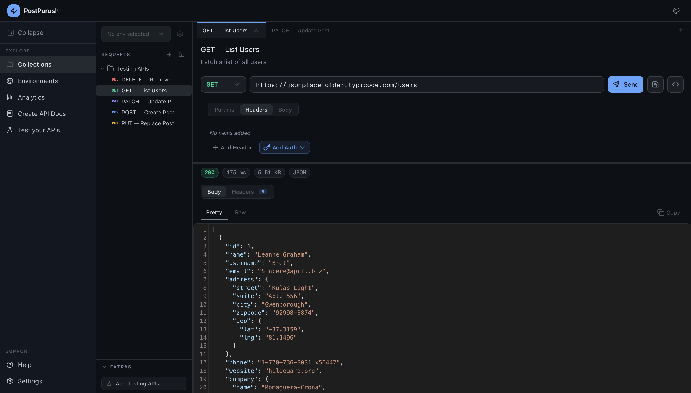
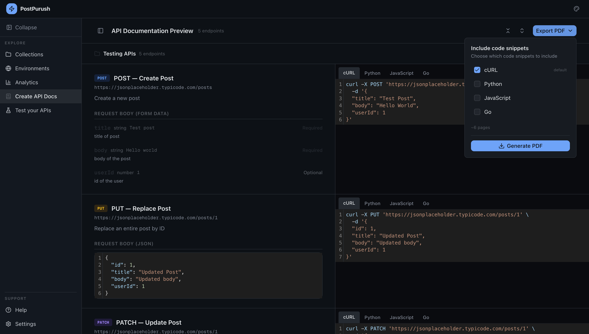
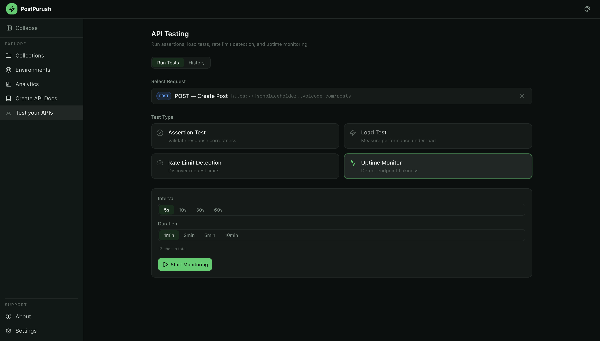
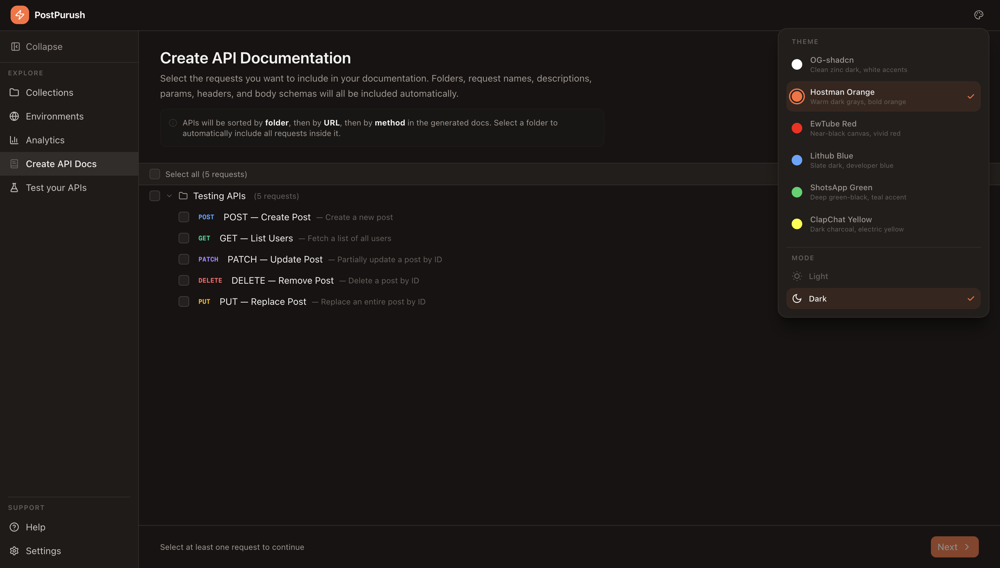

[](https://post-purush.vercel.app/)

# PostPurush
A modern API client for testing, analyzing, and documenting APIs — which sits entirely in the browser.
Built with Next.js App Router and Tailwind CSS.


## 🖼 Screenshots

### Collections


### Analytics Dashboard


### Environments


### API Documentation Generator


### Test your APIS


### Multiple Themes



## 🧠 Architecture Highlights

- **Local-First Design** – All data is stored in IndexedDB. No backend required.
- **No Accounts Required** – No sign-ups, no tracking, no external servers.
- **Modular Feature Architecture** – Each major feature (Collections, Environments, Analytics, Docs) is isolated into independent modules.
- **Optimized Rendering** – Next.js + Zustand ensures fast UI updates even with large collections.

## ✨ Features

### 🗂 Collections

-   Organize requests in folders with drag-and-drop reordering
-   Multiple open tabs with persistent state across tab switches
-   Unsaved change indicators per tab
-   Export code snippets in cURL, JavaScript, Python, Go, Java, PHP
-   Auto-save request state to IndexedDB

### 🌍 Environments

-   Create environments with custom icons and colors (11 presets)
-   `{{variable}}` syntax with live highlighting in the URL bar — valid vars in blue, missing in red
-   Sensitive variable masking with eye toggle
-   Variable resolution at send-time only — never stored in history

### 📊 Analytics

-   Automatic request history stored in IndexedDB
-   Summary stats: total requests, avg duration, P95, success rate, errors, avg response size, unique endpoints
-   Response time trend chart and error rate by endpoint chart
-   Slowest endpoints table
-   Searchable, filterable, sortable request history
-   Repeat any past request directly from analytics
-   Export as CSV

### 🧪 API Testing

-   **Assertion Testing** — write JS expressions against `response.status`, `response.body`, `response.time`, `response.headers`
-   **Load Testing** — sequential or concurrent (up to 10), with aggregate stats and response time chart. Generates a bash script for higher concurrency
-   **Rate Limit Detection** — auto-detect server throttling, estimated RPM, retry-after header support
-   **Uptime Monitoring** — poll endpoints at configurable intervals, live dot timeline
-   Isolated test history — never mixed with analytics

### 📄 API Documentation Generator

-   Select requests from collections with folder-level bulk selection
-   Auto-extracts params, headers, body schema, descriptions, types, required/deprecated flags
-   Two-column preview: documentation + live code snippets side by side
-   Collapsible folder sections, expand/collapse all, sidebar navigator
-   Export as themed PDF with optional code snippets (cURL, Python, JavaScript, Go, Java, PHP)
-   PDF includes cover page, table of contents, and syntax-highlighted code blocks

### ⚙️ Settings

-   6 themes × 2 modes (light/dark)
-   Collection sidebar text size slider with live preview
-   Request defaults: timeout and pre-populated headers for all new requests
-   Date/time format: relative or absolute throughout the app
-   Selective data export/import (Collections, Environments, Analytics, Test History)
-   Danger zone: clear analytics, clear test history, reset everything

### 📱 Mobile Support

-   Bottom navigation bar for all primary sections
-   Collections tree accessible via slide-in drawer
-   URL input opens a full modal editor on tap
-   Responsive layouts across Analytics, Environments, Testing, Settings, About

### 🎨 Themes

-   6 built-in themes: OG Shadcn, Hostman Orange, CuTube Red, LitHub Blue, ShotsApp Green, ClapChat Yellow
-   Full light and dark mode support
-   All UI elements including syntax highlighting and PDF exports respect the active theme


----------


## 🛠 Tech Stack
- **Framework**: Next.js 14+ (App Router), React, TypeScript
- **Styling**: Tailwind CSS, Shadcn UI, Radix UI Primitives
- **State Management**: Zustand
- **Local Storage / DB**: IndexedDB (`idb`)
- **Data Visualization**: Recharts
- **Code Editor / Syntax Highlighting**: `@uiw/react-codemirror`
- **PDF Generation**: `@react-pdf/renderer`
- **Icons**: Lucide React
- **Drag & Drop**: `@dnd-kit`

----------

## 💻 Getting Started

### Prerequisites

Make sure **Git** and **Bun** are installed before proceeding.

-   Install Bun: [https://bun.sh](https://bun.sh/)

### 1. Clone the repository

```bash
git clone https://github.com/singhgautam7/PostPurush.git
cd PostPurush

```

### 2. Install dependencies

```bash
bun install
# or
npm install

```

### 3. Run the development server

```bash
bun run dev
# or
npm run dev

```

### 4. Open the app

Navigate to [http://localhost:3000](http://localhost:3000/) in your browser.

All data is stored in your browser's IndexedDB — nothing leaves your machine.

----------

## Understand Each Section
1. [Collections](./docs/how-to/collections.md)
2. [Environments](./docs/how-to/environments.md)
3. [Analytics](./docs/how-to/analytics.md)
4. [Create API Docs](./docs/how-to/create-api-docs.md)

## 📄 License

This project is licensed under the **MIT License**.
See the [LICENSE](./LICENSE) file for details.
