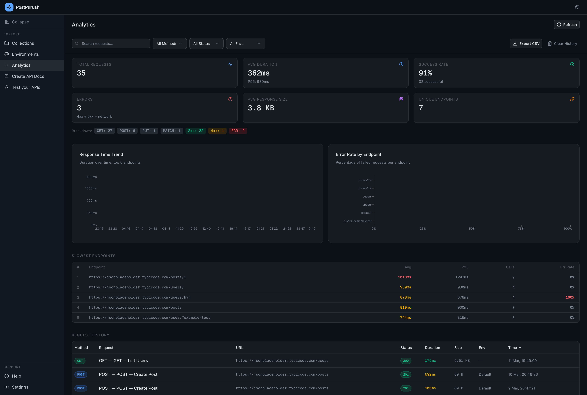
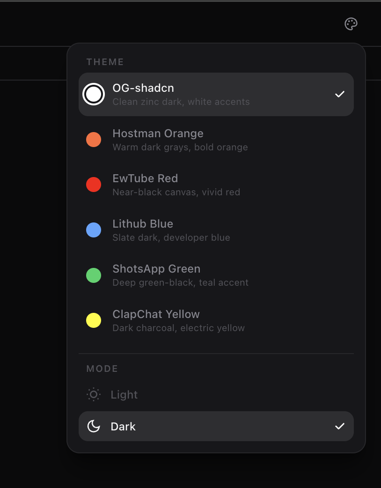

# PostPurush
A modern API client for testing, analyzing, and documenting APIs — which sits entirely in the browser.
Built with Next.js App Router and Tailwind CSS.


## 🖼 Screenshots

### Collections


### Analytics Dashboard


### Environments


### API Documentation Generator


<!-- ### Themes
 -->


## 🧠 Architecture Highlights

- **Local-First Design** – All data is stored in IndexedDB. No backend required.
- **No Accounts Required** – No sign-ups, no tracking, no external servers.
- **Modular Feature Architecture** – Each major feature (Collections, Environments, Analytics, Docs) is isolated into independent modules.
- **Optimized Rendering** – Next.js + Zustand ensures fast UI updates even with large collections.


## 🛠 Tech Stack
- **Framework**: Next.js 14+ (App Router), React, TypeScript
- **Styling**: Tailwind CSS, Shadcn UI, Radix UI Primitives
- **State Management**: Zustand
- **Local Storage / DB**: IndexedDB (`idb`)
- **Data Visualization**: Recharts
- **Code Editor / Syntax Highlighting**: `@uiw/react-codemirror`
- **PDF Generation**: `@react-pdf/renderer`
- **Icons**: Lucide React
- **Drag & Drop**: `@dnd-kit`

## 💻 Getting Started

### Prerequisites
Make sure you have Node.js and a package manager installed. I used `bun` for my setup.

### 1. Clone the repository
```bash
git clone https://github.com/singhgautam7/PostPurush.git
cd postpurush
```

### 2. Install dependencies
```bash
bun install
# or
npm install
# or
yarn install
```

### 3. Run the development server
```bash
bun run dev
# or
npm run dev
# or
yarn dev
```

### 4. Open the App
Navigate to [http://localhost:3000](http://localhost:3000) in your browser.
The app runs completely locally and stores all its data within your browser's IndexedDB.


## 📄 License

This project is licensed under the **MIT License**.
See the [LICENSE](./LICENSE) file for details.
