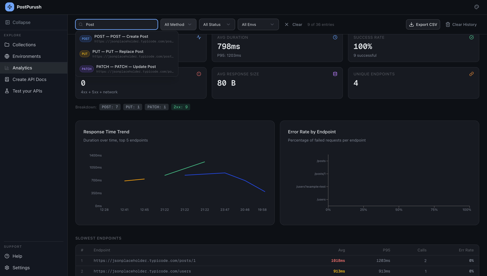
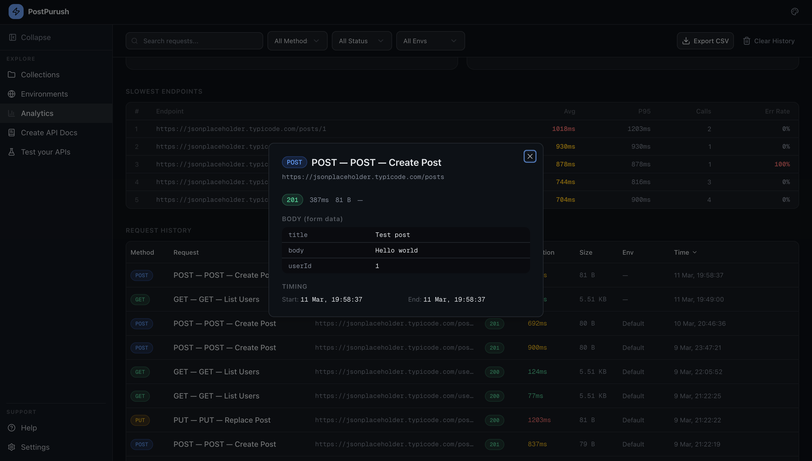

# Analytics

The **Analytics** section provides insights into API request performance and usage patterns.
Analytics are generated automatically based on requests executed within the application.

---

# Overview Dashboard

The top section of the Analytics page contains summary metrics.

Displayed metrics include:

- Total requests
- Average duration
- Success rate
- Error count
- Average response size
- Unique endpoints

These metrics provide a quick overview of API behavior.

---

# Filters

Users can filter analytics data using the filter controls at the top.

Available filters include:

- Request search
- HTTP method
- Status code category
- Environment

Filtering allows focused analysis of specific API behaviors.

---

# Response Time Trend

The Response Time Trend chart displays request latency over time.

This visualization helps identify:

- Performance degradation
- Slow endpoints
- Temporal trends in response times

Each line represents request performance across multiple executions.

---

# Error Rate by Endpoint

This chart displays the percentage of failed requests per endpoint.

The visualization helps detect:

- Endpoints with frequent failures
- Instability in specific API routes
- Error patterns over time

---

# Slowest Endpoints

The Slowest Endpoints table ranks API endpoints based on latency.

Each entry includes:

- Endpoint URL
- Average response time
- P95 response time
- Call count
- Error rate

This section helps identify performance bottlenecks.

---

# Request History

The Request History table displays all executed requests.

Each entry includes:

- HTTP method
- Request name
- URL
- Status code
- Duration
- Response size
- Environment
- Execution time

Users can quickly review historical request activity.

---

# Request Detail View

Hovering on the request reveals an "eye" icon, on clicking of which a

The detail panel displays:

- Request method
- Endpoint URL
- Response status
- Response time
- Response size
- Request body
- Execution timestamps

This view helps analyze individual request behavior.

---

# Exporting Analytics

- Analytics data can be exported as a **CSV file**.
- Users can also clear request history if needed.

---
