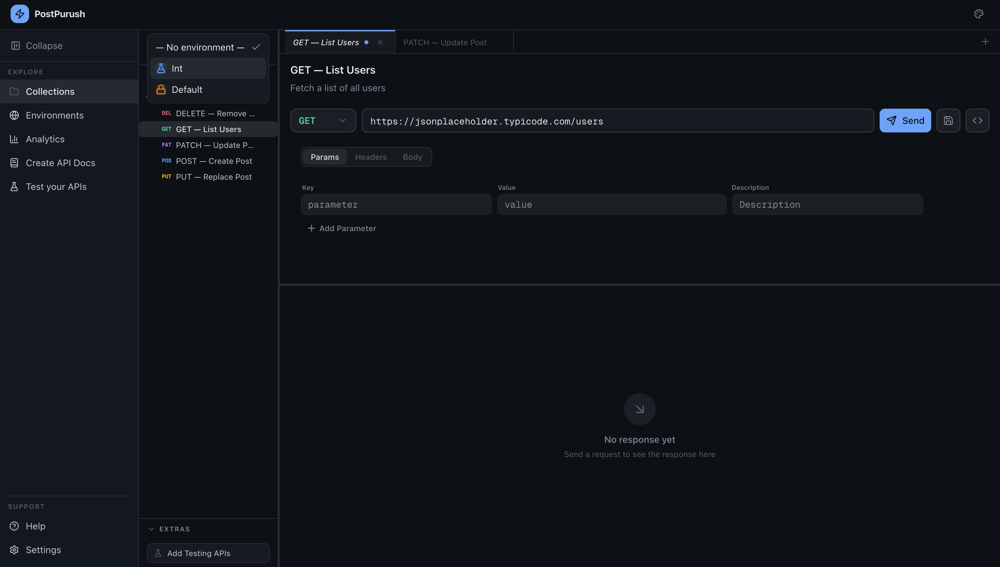
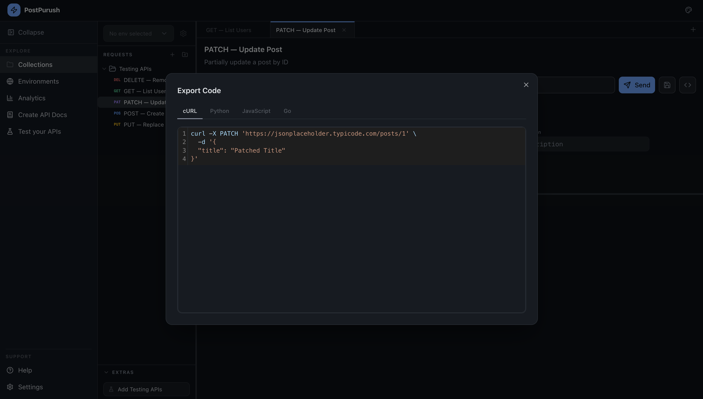
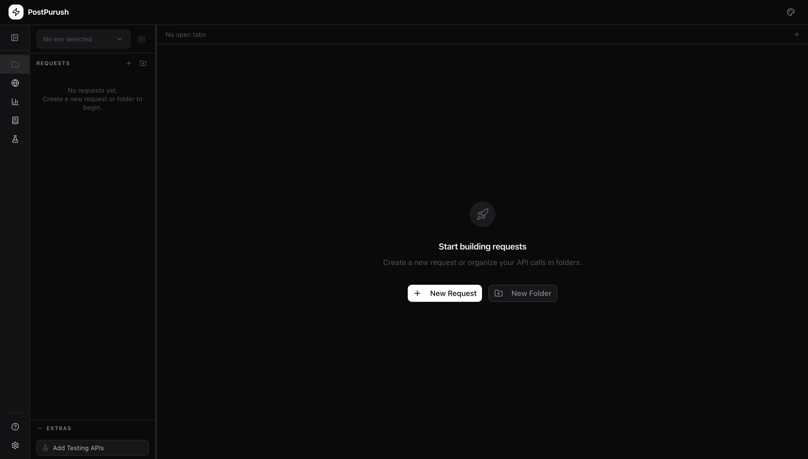

# Collections

The **Collections** section is the primary workspace for interacting with APIs. It allows users to organize requests, execute them, inspect responses, and export code examples.

---

# Workspace Layout

The Collections workspace is divided into three primary areas:

### 1. Global Navigation Sidebar (Left)

This sidebar provides navigation across the application:

- Collections
- Environments
- Analytics
- Create API Docs
- Test your APIs

Additional items:

- About
- Settings

---

### 2. Collection Request Sidebar

The secondary sidebar (to the right of the global navigation sidebar) displays the request tree.

This sidebar contains:

- **Folders**
- **Requests**
- Nested structures for organizing APIs

Users can:

- Create new requests
- Create folders
- Rename or delete items
- Drag and reorder requests
- Move requests between folders

The sidebar is **resizable** but not collapsible.

---

# Environment Selector

At the top of the request sidebar, an **Environment Selector** is available.

Users can:

- Select an active environment
- Access environment settings
- Switch between environments while testing requests
- Modify the environment variables right away by clicking on the 'gear' icon

Environment variables are automatically resolved when requests are executed.

---

# Request Tabs

The main workspace supports **multiple request tabs**.

Tabs behave similarly to a code editor:

- Multiple requests can remain open simultaneously
- Tabs can be switched instantly
- Unsaved changes are indicated with a marker
- Tabs can be closed independently

This allows parallel testing of different endpoints.

---

# Request Builder

Each request tab contains the request editor.

The request builder includes:

### Method Selector
Supported HTTP methods include:

- GET
- POST
- PUT
- PATCH
- DELETE

The selected method is visually highlighted with color coding.

---

### URL Input

The URL input field supports:

- Full endpoint URLs
- Query parameters
- Environment variable references

The input expands automatically for longer URLs.

---

### Request Tabs

The request editor is divided into sections:

- Params
- Headers
- Body

Each section allows structured editing of request data along with the support of environment variables.

---

### Params

The Params tab allows configuration of query parameters.

Capabilities include:

- Adding key-value parameters
- Removing parameters
- Editing parameter values

Parameters automatically synchronize with the URL query string.

---

### Headers

The Headers tab allows editing of HTTP headers.

Users can:

- Add custom headers
- Delete headers
- Use **Add Auth** presets for common authorization patterns

Examples include:

- Bearer Token
- API Key
- Basic Authentication

---

### Body

The Body tab supports request payload configuration.

Supported body types include:

- JSON
- Raw text
- Key-value form data

The body editor supports structured editing depending on the selected type.

---

# Sending Requests

The **Send** button executes the request.

When a request is sent:

- The HTTP request is executed directly from the browser
- Environment variables are resolved
- The response is displayed in the response panel

---

# Response Viewer

The response panel appears below the request builder.

Displayed information includes:

- HTTP status code
- Response time
- Response size
- Content type

---

### Response Tabs

Users can inspect responses through multiple views:

- Body
- Headers

Body supports two modes:

- Pretty (formatted)
- Raw

JSON responses include:

- Syntax highlighting
- Line numbers
- Collapsible structures

---

# Code Export

Requests can be exported into multiple programming languages.

Code snippets are automatically generated based on the current request configuration.

---

# Add Testing APIs

At the bottom of the sidebar, the **Add Testing APIs** option is available.

This feature:

- Adds a predefined collection of example endpoints
- Allows users to explore the interface immediately
- Demonstrates supported HTTP methods and request structures

The testing APIs are useful for:

- Learning the interface
- Experimenting with requests
- Understanding response handling

---

# Theme selector

There is a global theme selector on the top-right section of the screen (available on header of each page) which enables you to choose between different colors, and dark mode and light mode.
