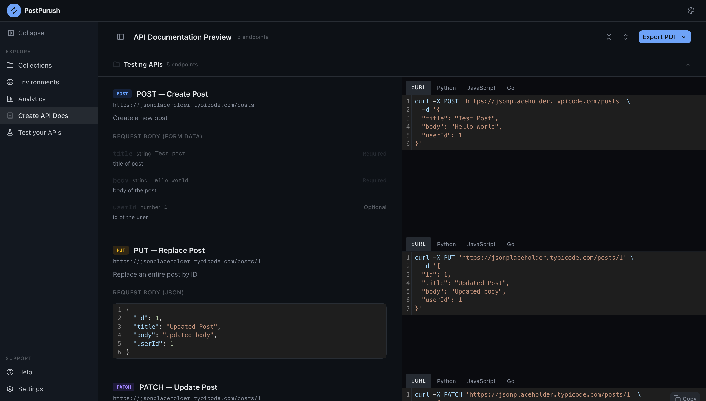
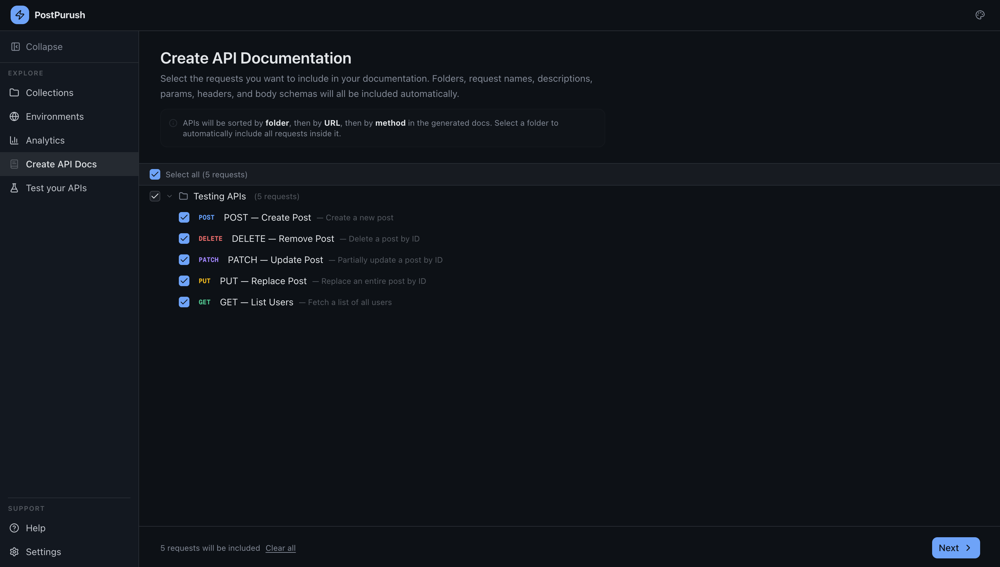

# Create API Documentation

The **Create API Docs** section allows users to generate structured API documentation directly from saved requests.
This feature converts request definitions into readable documentation.

---

# Documentation Workflow

The documentation generation process consists of three steps:

1. Select requests
2. Preview documentation
3. Export documentation

---

# Selecting Requests

The first step is selecting the requests to include.

Requests are displayed grouped by folder.

Users can:

- Select individual requests
- Select entire folders
- Select all available requests

The interface shows the total number of requests selected.

Documentation will include all selected endpoints.

---

# Automatic Data Extraction

The documentation generator automatically extracts information from requests.

Included information:

- Endpoint URL
- HTTP method
- Request description
- Request body schema
- Example request payload
- Code examples

Requests are sorted by:

- Folder
- URL
- Method

---

# Documentation Preview

After selecting requests, users can preview the generated documentation.

The preview page displays each endpoint with:

- Endpoint name
- Description
- Request URL
- Request body schema
- Code examples

Each endpoint section provides a structured layout similar to professional API documentation.

---

# Code Snippets

Documentation includes code examples for supported languages.
Users can choose which languages to include.
Each snippet demonstrates how to execute the request programmatically.

---

# Exporting Documentation

Documentation can be exported as a **PDF document**.

The export dialog allows selecting:

- Code snippet languages to include
- Final document generation

The generated PDF contains:

- Structured API reference
- Endpoint descriptions
- Request examples
- Code samples

[Here](./assets/sample-exported-api-doc.pdf) is an example of the exported API document.
---
