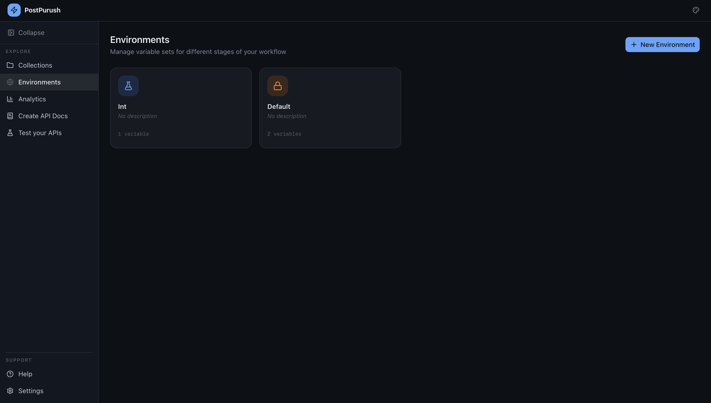
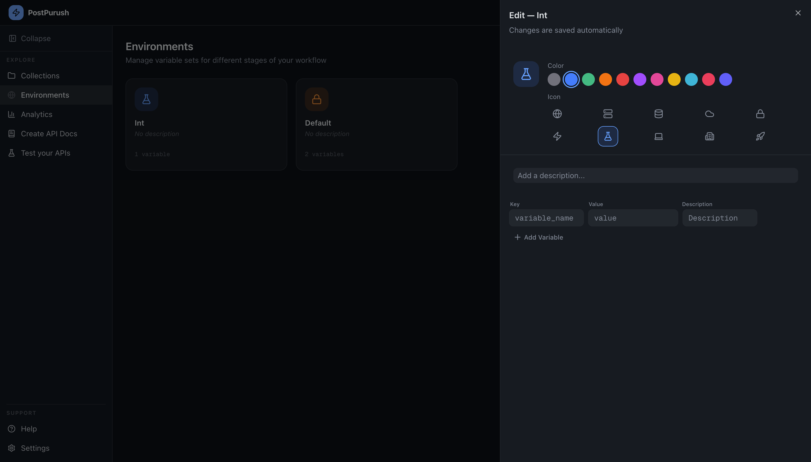

# Environments

The **Environments** section allows users to manage reusable variables that can be referenced inside requests.

Refer to the Environments screenshots for the layout and editing interface.

---

# Purpose of Environments

Environments provide a structured way to define values that change across different stages of development.

Examples include:

- Base URLs
- Authentication tokens
- API keys
- Version identifiers

Instead of modifying requests repeatedly, users can reference variables.

Example reference format:

{{variable_name}}

---

# Environment Overview

The Environments page displays environments as **cards**.

Each card contains:

- Environment name
- Optional description
- Variable count
- Environment icon
- Color identifier

This layout allows quick visual identification of environments.

---

# Creating a New Environment

Users can create a new environment using the **New Environment** button.

Creating an environment allows:

- Naming the environment
- Assigning a visual icon
- Choosing a color for quick identification

---

# Environment Editor

Selecting an environment opens the **Environment Editor panel**.

The editor appears as a side panel and supports real-time editing.

The editor includes:

- Environment name
- Description field
- Icon selection
- Color selection
- Variable list

Changes are saved automatically.

---

# Icon and Color Customization

Each environment can be visually customized.

Options include:

- Multiple icon selections
- Color indicators

This improves recognition when switching between environments.

---

# Variable Management

Variables are defined using a table structure.

Each variable contains:

- Key
- Value
- Description (Optional)
- Required (boolean, default=False)
- Deprecated (bool, default=False)
- Sensitive (bool, default=False)

In case a variable is marked as sensitive, the value of the variable will be masked in the UI.

Users can:

- Add variables
- Modify values
- Remove variables

Variables become available throughout the application when the environment is active.

---

# Environment Usage

When an environment is selected:

- All variables become available in the request builder
- Variables are resolved automatically before request execution

Example usage in a request URL:

{{base_url}}/users

Example usage in headers:

Authorization: Bearer {{token}}

---

# Automatic Updates

The environment editor saves changes automatically.
There is no manual save step required.

---
