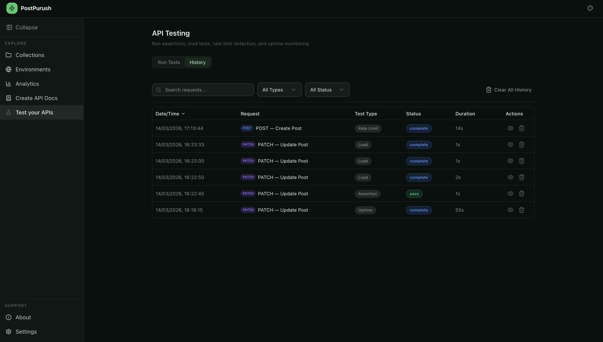
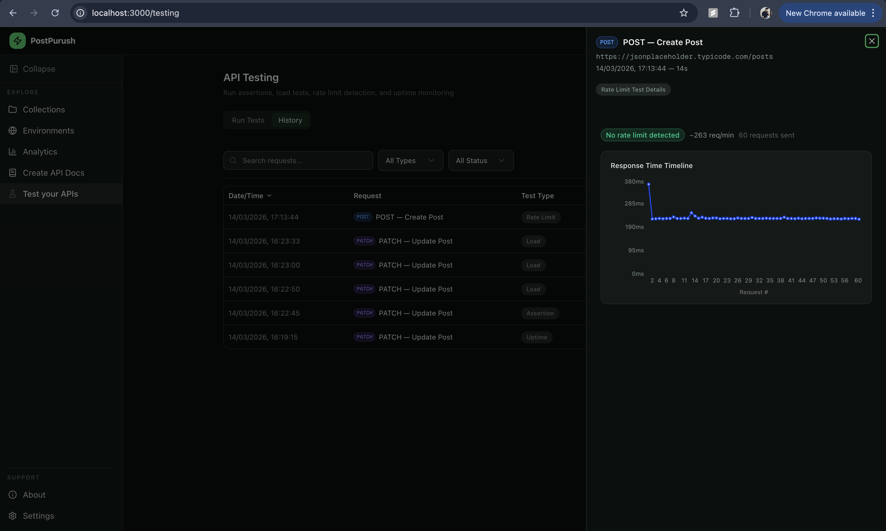

# Test Your APIs

The **Testing** section provides tools to validate, benchmark, and monitor your APIs.
Four test types are available: Assertion, Load, Rate Limit Detection, and Uptime Monitor.
Select a saved request from the dropdown, choose a test type, configure parameters, and run.

---

# Getting Started

To begin testing:

- Select a saved request from the **request selector** dropdown
- Choose one of the four test types from the tabs
- Configure test-specific parameters
- Click **Run** to execute the test

All test results are saved automatically and can be reviewed in the history panel.

---

# Assertion Test

Assertion tests let you write JavaScript expressions that validate the response from your API.

Each assertion is evaluated against the `response` object with the following properties:

- `status` — HTTP status code (e.g. 200)
- `statusText` — status text (e.g. "OK")
- `time` — response time in milliseconds
- `size` — response size in bytes
- `body` — parsed response body
- `headers` — response headers object

Results show a per-assertion pass/fail breakdown.

---

# Load Test

Load tests measure how your API handles multiple requests.

Configuration options:

- **Request count** — number of requests to send (1–100)
- **Mode** — sequential or concurrent execution

Results include:

- Total requests, successes, and failures
- Average response time
- P95 response time
- Requests per second
- Bar chart visualization of response times

For concurrent tests, a shell script can be downloaded to run outside the browser.

---

# Rate Limit Detection

Rate limit detection identifies throttling behavior in your API.

Configuration options:

- **Max requests** — total requests to send
- **Delay** — milliseconds between requests

The test automatically detects `429` and `503` responses and reports:

- Estimated requests per minute (RPM)
- Retry-After header value (if present)
- Line chart showing response times with a reference line at the limit point

---

# Uptime Monitor

The uptime monitor tracks API availability over a period of time.

Configuration options:

- **Interval** — time between checks (5s–60s)
- **Duration** — total monitoring time (1–10 minutes)

The monitor displays:

- Live dot timeline — green for success, red for failure, grey for pending
- Uptime percentage
- Average response time

---

# Test History

All completed test runs are saved automatically.

- View past results by opening the history side panel
- Each entry shows test type, request name, timestamp, and result summary
- Delete individual runs or clear all history

---
